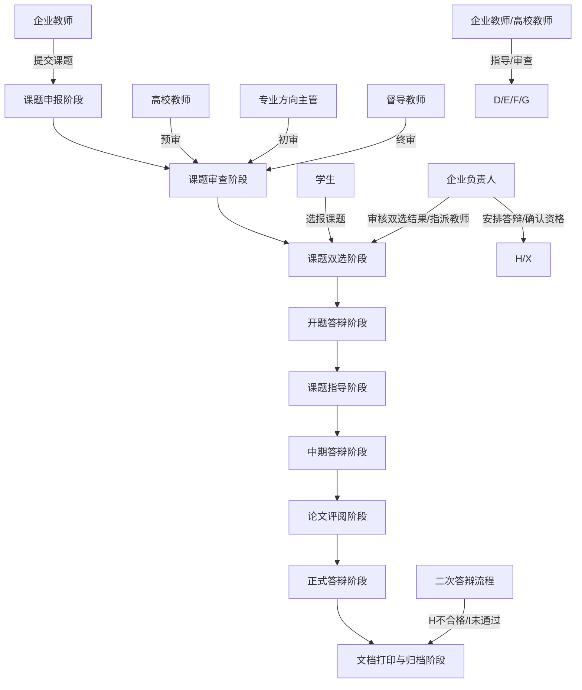

# 毕业设计全过程管理系统需求规格说明书

## 1. 引言

### 1.1 项目背景
随着高等教育信息化的发展，传统的毕业设计管理模式已无法满足现代化教学管理的需求。为提高毕业设计管理效率，规范管理流程，实现全过程数字化管控，特开发此毕业设计全过程管理系统。

### 1.2 项目目标
构建一个集课题管理、过程指导、质量监控、审批流程于一体的综合性管理平台，实现毕业设计全过程的数字化、规范化管理。

### 1.3 适用范围
本系统适用于高等院校计算机相关专业毕业设计的全过程管理，包括课题申报、双选、指导、答辩等各阶段。

## 2. 系统概述

### 2.1 系统架构
采用前后端分离的微服务架构，后端使用Spring Boot + Spring Cloud，前端使用Vue.js，数据库采用MySQL + Redis。

### 2.2 技术栈
- 语言:java 17 
- 后端：Spring Boot 3.2.x, Spring Security 6.x, MyBatis Plus 3.5.x
- 消息队列：RabbitMQ 3.12.x（异步通知、文件处理任务）
- 搜索引擎：Elasticsearch 8.x（课题检索、论文全文检索）
- 前端：Vue 3.4.x, Ant Design Vue 4.x, ECharts 5.x（数据可视化）
- 数据库：MySQL 8.0.x, Redis 3.2.100
- 文件存储：MinIO（对象存储）
- 文档处理：OnlyOffice（在线编辑）、Apache POI（文档解析）
- 流程引擎：Flowable 7.x（轻量级工作流引擎）

## 3. 角色定义与权限管理

### 3.1 系统角色概览
| 角色名称 | 角色代码 | 核心职能 | 核心工作职责 | 关键限制 |
|---------|---------|---------|---------|---------|
| 企业教师 | ENTERPRISE_TEACHER | 课题申报、学生选题确认、毕设全程指导 | 课题创建/编辑/删除；确认选题人选；开题任务书编辑；项目指导记录提交；中期检查表提交；答辩资格审查；指导成绩评定 | 最多指导16人/届；课题通过高校预审后不可删除 |
| 企业负责人 | ENTERPRISE_LEADER | 企业端毕设工作统筹管理 | 课题申报审核；双选结果审查；答辩安排（开题/中期/正式/二次）；指派企业指导教师；师生信息管理；指导记录监督 | 需确保所有学生完成选报；协同创新/校外课题学生需指派教师 |
| 高校教师 | UNIVERSITY_TEACHER | 课题预审、学生毕设指导、论文审查、成绩评语评定 | 课题预审提交修改意见；查看/导出指导学生选题结果；论文指导与修改意见提交；中期答辩审查；论文审查；成绩评定与评语 | 预审通过的课题后续环节通过后不可修改状态 |
| 专业方向主管 | MAJOR_DIRECTOR | 毕业设计课题初审，企业教师指导记录审查 | 分类开展课题初审（高职升本/实验班/3+1）；单个/批量审批；提交综合修改意见；审查企业教师指导记录；导出指导记录 | 按课题类型分类管理；需确保指导记录质量 |
| 督导教师 | SUPERVISOR_TEACHER | 毕业设计课题终审，课题审查最后环节 | 查看预审+初审通过的课题；单个/批量审批；修改审批结果；提交综合意见（所有企业教师可见）；把控课题数量 | 每位指导教师通过终审的课题≤18个；终审为课题审查最后环节 |
| 学生 | STUDENT | 完成毕业设计全流程操作执行 | 完善个人信息；课题选报（最多3个）；开题报告提交；项目代码与论文文档提交；根据指导意见修改；参与各阶段答辩；文档打印 | 选报需完善个人信息；各环节有截止日期；不合格者仅能参加二次答辩 |
| 系统管理员 | SYSTEM_ADMIN | 系统配置、用户管理、数据维护 | 系统配置、用户管理、权限分配、数据备份与恢复；教师指导数量上限配置；批量导入师生信息 | 超级权限；负责系统运维和数据安全 |

### 3.2 角色详细权限清单

#### 3.2.1 企业教师（ENTERPRISE_TEACHER）
**核心职能**：课题申报、学生选题确认、毕设全程指导、答辩资格审查、成绩评定

| 功能模块 | 具体功能 | 操作权限 |
|---------|---------|---------|
| **课题申报管理** | 创建/编辑/删除课题（未通过高校预审前）| 增/删/改 |
| | 查看课题审查意见（高校教师、专业方向主管、督导教师意见）| 查 |
| | 修改课题信息（根据审查意见）| 改 |
| | 查看课题审查状态流转记录 | 查 |
| **课题双选管理** | 查看选报学生信息（姓名、学号、选报理由）| 查 |
| | 确认选题人选（每教师最多16人）| 确认 |
| | 导出已确认学生信息 | 导出 |
| **开题答辩管理** | 编辑开题任务书 | 增/改 |
| | 查看学生开题报告 | 查 |
| | 审查开题报告（通过/不合格）| 审 |
| | 设置审查状态 | 设置 |
| **课题指导管理** | 查看/下载学生项目文档 | 查/下载 |
| | 提交项目指导记录及修改意见 | 增 |
| | 删除错误指导记录 | 删 |
| | 提交改题申请/查询改题状态 | 增/查 |
| | 修改开题任务书（改题通过后）| 改 |
| **中期答辩管理** | 提交/编辑中期检查表 | 增/改 |
| | 查看中期审查结果（高校教师审查意见）| 查 |
| **答辩资格管理** | 审查学生答辩资格（通过开题、中期、论文审阅）| 审 |
| | 设置不合格状态（不合格学生仅能参加二次答辩）| 设置 |
| **成绩评语管理** | 提交/编辑学生指导成绩和评语 | 增/改 |
| | 查看高校教师评分 | 查 |
| **打印权限管理** | 开放/关闭学生文档打印权限（需完成成绩提交）| 设置 |
| **基础功能** | 个人中心（修改电话/邮箱/办公地址）| 查/改 |
| | 留言功能（添加/回复/删除）| 增/改/删 |
| | 下载专区（模板下载）| 查/下载 |

**工作职能细节**：
1. 确保课题信息完整合规，及时响应各级审查意见
2. 合理分配指导名额（每届不超过16人），准确确认选题学生
3. 定期查看学生项目/论文进度，及时提交指导记录
4. 严格执行审查流程，客观公正进行开题、中期、答辩资格审查
5. 按时提交成绩和评语，与高校教师协同确认学生论文质量

#### 3.2.2 企业负责人（ENTERPRISE_LEADER）
**核心职能**：企业端工作统筹、答辩安排、师生信息管理、多环节审查监督

| 功能模块 | 具体功能 | 操作权限 |
|---------|---------|---------|
| **课题申报审核** | 分类查看企业教师提交的课题信息 | 查 |
| | 查看课题审查状态（预审/初审/终审）| 查 |
| | 企业内部申报审核 | 审 |
| **课题双选管理** | 审查双选结果（确保所有学生完成选报）| 查/审 |
| | 导出选题信息 | 导出 |
| | 指派/取消指派企业指导教师（协同创新/校外课题）| 指派/取消 |
| **开题答辩管理** | 设置开题答辩安排（时间/地点/答辩小组教师）| 增/改 |
| | 导出开题答辩记录表 | 导出 |
| | 查看开题报告提交/审核情况 | 查 |
| | 查看开题文档（任务书/报告）| 查 |
| **课题指导管理** | 审查教师指导记录（指导频次、内容质量）| 查/审 |
| | 审查学生项目/论文文档提交情况 | 查/审 |
| | 查看学生毕设文档 | 查 |
| **中期答辩管理** | 设置中期答辩安排（时间/地点/答辩教师）| 增/改 |
| | 确认答辩学生名单（仅同意开题的学生）| 确认 |
| | 查看中期检查表提交/审查结果 | 查 |
| | 查看中期检查表 | 查 |
| **教师信息管理** | 查看企业教师基本信息（姓名/电话/邮箱/指导方向）| 查 |
| | 查看教师指导学生数量 | 查 |
| **学生信息管理** | 查看学生信息列表 | 查 |
| | 按姓名/学号模糊查询学生信息 | 查询 |
| | 导出学生信息表 | 导出 |
| **答辩安排管理** | 安排正式/二次答辩（时间/地点/答辩小组）| 增/改 |
| | 确认答辩学生名单 | 确认 |
| | 查看答辩结果 | 查 |
| **基础功能** | 个人中心、留言功能、下载专区 | 查/改 |

**工作职能细节**：
1. 统筹企业内毕设计划，确保各阶段任务按时推进
2. 严格审核双选结果，确保无学生遗漏，指派教师合理
3. 精准设置答辩安排，提前通知相关人员
4. 监督教师指导质量，定期查看指导记录
5. 做好师生信息管理，确保信息准确可查

#### 3.2.3 高校教师（UNIVERSITY_TEACHER）
**核心职能**：课题预审、学生论文指导、中期审查、论文审查、成绩评定

| 功能模块 | 具体功能 | 操作权限 |
|---------|---------|---------|
| **课题审阅管理** | 课题预审（查看课题详情）| 查/审 |
| | 提交单个/批量审查意见（通过/需修改）| 增/批量 |
| | 修改预审状态（后续环节通过前可改）| 改 |
| | 查看审阅结果 | 查 |
| **课题双选管理** | 查看/导出指导学生选题信息 | 查/导出 |
| **中期答辩管理** | 审查学生中期检查表 | 查/审 |
| | 设置中期审查意见（合格/不合格）| 设置 |
| **论文指导管理** | 查看/下载学生论文 | 查/下载 |
| | 提交论文指导记录及修改意见 | 增 |
| | 上传带修改意见的论文文档 | 上传 |
| | 查看所有指导记录 | 查 |
| | 删除错误指导记录 | 删 |
| **论文审查管理** | 设置学生论文审查状态（合格/不合格）| 审/设置 |
| **成绩评语管理** | 提交/编辑学生指导成绩和评语 | 增/改 |
| | 查看企业教师成绩 | | **基础功能** | 个人中心、留言功能（添加/回复/删除）、下载专区 | 查/改 |

**工作职能细节**：
1. 严格按标准进行课题预审，及时反馈修改意见
2. 重点关注学生论文质量，提供针对性指导
3. 客观进行中期审查和论文审查
4. 按时提交成绩和评语
5. 通过留言功能与学生、企业教师沟通

#### 3.2.4 专业方向主管（MAJOR_DIRECTOR）
**核心职能**：课题初审、教师指导记录审查、分类型毕设管理

| 功能模块 | 具体功能 | 操作权限 |
|---------|---------|---------|
| **课题初审管理** | 分课题大类（高职升本/3+1/实验班）进行课题初审 | 查/审 |
| | 单个/批量审批 | 审/批量 |
| | 提交综合修改意见（对应范围所有教师可见）| 增 |
| | 查看教师课题审查情况 | 查 |
| **课题指导审查** | 分课题类型审查企业教师指导记录 | 查/审 |
| | 查看指导课题数量/最新提交时间 | 查 |
| | 导出所有教师指导记录 | 导出 |
| **基础功能** | 个人中心（修改电话/邮箱/办公地址）| 查/改 |
| | 下载专区 | 查/下载 |

**工作职能细节**：
1. 严格执行课题初审标准，确保课题符合专业培养要求
2. 针对共性问题提交综合修改意见
3. 定期审查教师指导记录，监督指导质量
4. 按课题类型分类管理，精准把控进度

#### 3.2.5 督导教师（SUPERVISOR_TEACHER）
**核心职能**：课题终审、审查结果修改、综合意见提交

| 功能模块 | 具体功能 | 操作权限 |
|---------|---------|---------|
| **课题终审管理** | 查看经预审/初审通过的课题列表 | 查 |
| | 单个/批量审批课题 | 审/批量 |
| | 修改已通过/未通过课题的审批结果 | 改 |
| | 查看课题详情及各环节审查记录 | 查 |
| | 监控每位教师通过终审的课题数量（≤18个）| 查/监控 |
| **综合意见管理** | 提交综合修改意见（所有企业教师可见）| 增 |
| | 删除错误综合意见 | 删 |
| | 重新提交综合意见 | 改 |
| **基础功能** | 个人中心、下载专区 | 查/改 |

**工作职能细节**：
1. 作为课题审查最终环节，严格把控课题质量
2. 针对共性问题提交综合意见
3. 可追溯修改审批结果，及时纠正审查失误
4. 监督课题审查流程执行情况

#### 3.2.6 学生（STUDENT）
**核心职能**：完成毕设全流程操作、响应指导意见、参与答辩、打印归档

| 功能模块 | 具体功能 | 操作权限 |
|---------|---------|---------|
| **个人信息管理** | 完善个人信息（电话、邮箱、QQ必填）| 增/改 |
| | 修改个人信息 | 改 |
| **课题双选管理** | 查看课题列表（按类型/方向筛选）| 查 |
| | 选报课题（最多3个，需填写选报理由）| 增 |
| | 查看选报结果 | 查 |
| | 删除选报记录重新选报（落选后）| 删/增 |
| **开题答辩管理** | 查看开题答辩安排 | 查 |
| | 提交/编辑开题报告（截止日期前）| 增/改 |
| | 查看开题审查结果 | 查 |
| | 查看/打印开题任务书 | 查/打印 |
| **课题辅导管理** | 提交项目代码文件 | 增 |
| | 提交论文文档 | 增 |
| | 查看项目指导意见（企业教师）| 查 |
| | 查看论文指导意见（高校教师）| 查 |
| | 下载带修改意见的论文 | 下载 |
| **中期答辩管理** | 查看中期答辩安排 | 查 |
| | 查看中期答辩结果 | 查 |
| | 查看/打印中期检查表 | 查/打印 |
| **论文评阅管理** | 查看论文评阅意见 | 查 |
| **答辩管理** | 查看正式/二次答辩安排 | 查 |
| | 参加答辩 | 参与 |
| | 查看答辩结果 | 查 |
| **文档打印管理** | 查看打印权限状态 | 查 |
| | 打印毕业设计相关文档 | 打印 |
| **基础功能** | 个人中心、留言功能（添加/回复/删除）、下载专区 | 查/改 |

**工作职能细节**：
1. 按时完善个人信息，确保顺利参与选题
2. 合理选择课题，及时关注选报结果
3. 严格按截止日期提交各类文档
4. 认真查看指导意见，及时修改完善
5. 按时参加各阶段答辩，遵守答辩纪律
6. 获得打印权限后，及时打印装订文档

### 3.3 权限控制策略
- **基于RBAC模型**：角色-权限-资源三层映射
- **细粒度权限控制**：操作权限细分为查看、编辑、审批、导出、设置等
- **数据权限隔离**：
  - 企业教师仅可查看本企业课题和学生
  - 高校教师仅可查看指导学生信息
  - 学生仅可查看个人相关数据
- **权限动态配置**：支持管理员按需调整角色权限范围
- **操作审计追踪**：所有关键操作（审查、评分、修改）全程记录

## 4. 业务流程设计

### 4.1 核心业务流程总览
系统核心围绕**课题全生命周期管理**、**学生毕业设计执行**、**多角色协同审核**三大主线展开，整体流程闭环如下：



### 4.2 各阶段详细业务流程

#### 4.2.1 课题申报阶段

**流程描述**：
1. 企业教师按课题大类（高职升本/3+1/实验班）填写课题信息（题目、内容简述、拟解决问题、专业训练描述等）
2. 3+1/实验班课题需指定适用学校
3. 企业教师提交课题后，可查看各审查环节意见，根据意见修改课题
4. 高校教师预审通过后课题不可删除，仅可修改内容
5. 企业负责人分类查看企业教师提交的课题信息及审查状态，进行企业内部申报审核

**参与角色及操作**：
- 企业教师：课题创建、信息编辑、删除（未通过高校预审前）、查看审查意见
- 企业负责人：课题申报审核、分类查看课题状态

**关键规则**：
- 课题名称不超过50字符
- 内容简述/拟解决问题不少于100字
- 专业训练描述不少于50字
- 不同大类课题审查链路：
  - 高职升本：高校教师预审 → 专业方向主管初审 → 督导教师终审
  - 3+1/实验班：专业方向主管初审 → 高校教师终审

**流程图**：
```
[开始] → 企业教师创建课题 → 填写课题信息（题目/类型/内容/专业训练等）→ 指定适用学校（3+1/实验班）→ 提交课题 → 企业负责人审核 → 进入审查阶段 → [结束]
     ↑                                                                                          |
     |←←←←←←←←←←←←←←←←←←← 审查不通过，企业教师根据意见修改 ←←←←←←←←←←←←←←←←←←←←←←←←←←←|
```

#### 4.2.2 课题审查阶段

**流程描述**：
1. **高校教师预审**
   - 接收课题预审任务，查看课题详情
   - 提交单个/批量审查意见（通过/需修改）
   - 可修改已通过预审的课题状态（后续环节通过后不可改）
   
2. **专业方向主管初审**
   - 接收初审任务，分课题大类审查
   - 支持单个/批量审批
   - 可提交综合修改意见（所有审核教师可见）
   - 查看教师课题审查情况
   
3. **督导教师终审**
   - 仅审查经高校教师预审、专业方向主管初审通过的课题
   - 支持单个/批量审批、修改审批结果
   - 提交综合意见（所有企业教师可见）
   - 监控每位指导教师通过终审的课题数量（上限18个）
   
4. 终审通过的课题进入双选环节，企业教师通过终审的课题达18个时，无需后续审查

**参与角色及操作**：
- 高校教师：课题预审、提交修改意见、查看预审结果、修改审查状态
- 专业方向主管：课题初审、单个/批量审批、提交综合修改意见、查看教师审查详情
- 督导教师：课题终审、单个/批量审批、修改审批结果、提交综合意见、查看各环节审查记录

**关键规则**：
- 审查意见分"单课题修改意见"和"综合修改意见"
- 综合意见对对应范围内所有教师/课题可见
- 督导教师终审为课题审查最后环节，未通过终审的课题无法进入双选
- 审查流程顺序校验：预审 → 初审 → 终审（严格按顺序执行）

**流程图**：
```
[课题进入审查] → 高校教师预审 → 通过？
                       ↓否                ↓是
                 返回企业教师修改 → 专业方向主管初审 → 通过？
                                           ↓否                ↓是
                                     返回企业教师修改 → 督导教师终审 → 通过？
                                                                ↓否                ↓是
                                                          返回企业教师修改 → 课题进入双选环节
```

#### 4.2.3 课题双选阶段

**流程描述**：
1. **学生选报课题**
   - 学生完善个人信息（电话为必填项）
   - 查看课题列表（按类型/方向筛选）
   - 选报课题（最多3个），填写选报理由
   - 落选后可删除选报记录重新选报
   
2. **企业教师确认选题**
   - 查看课题选报学生信息及选报理由
   - 确认课题人选（每位教师最多指导16人）
   - 可导出已确认学生信息
   
3. **企业负责人审查双选**
   - 审查双选结果，确保所有学生完成选报
   - 导出选题信息
   - 为高职升本选报协同创新/校外课题的学生指派企业指导教师
   - 可取消错误指派
   
4. **高校教师查看选题**
   - 查看/导出指导学生的选题结果及基本信息

**参与角色及操作**：
- 学生：完善个人信息、选报课题、查看选报结果、重新选报
- 企业教师：确认选题人选、查看/导出学生信息
- 企业负责人：审查双选结果、导出选题信息、指派/取消指派企业指导教师
- 高校教师：查看/导出指导学生选题信息

**关键规则**：
- 学生必须完善个人信息才能参与选题
- 学生选报数量≤3个，选报理由必填
- 企业教师确认人数≤16人/教师
- 企业负责人需确保选报协同创新/校外课题的学生均有指派教师
- 落选后才可删除选报记录

**流程图**：
```
[开始] → 学生完善个人信息 → 查看课题列表 → 选报课题（最多3个）→ 填写选报理由 → 提交选报
         ↓
企业教师查看选报学生 → 确认课题人选（最多16人）→ 学生是否中选？
         ↓否                                                ↓是
落选学生删除记录重新选报 ←←←←←←←←←←←←← 企业负责人审查双选结果 → 指派协同创新/校外课题指导教师 → [结束]
```

#### 4.2.4 开题答辩阶段

**流程描述**：
1. **企业负责人安排答辩**
   - 按课题类型设置开题答辩安排（时间、地点、答辩小组教师）
   - 可导出开题答辩记录表
   
2. **企业教师编辑开题任务书**
   - 编辑开题任务书，为学生提供开题指导
   - 查看学生提交的开题报告
   - 进行审查（未提交报告不可审查）
   - 不合格学生直接进入二次答辩
   
3. **学生提交开题报告**
   - 查看开题答辩安排
   - 在截止日期前提交/编辑开题报告
   - 查看审查结果（不合格则取消毕业设计资格）
   
4. **企业负责人监督开题**
   - 查看学生开题报告提交与审核情况
   - 查看开题任务书及报告文档

**参与角色及操作**：
- 企业负责人：设置答辩安排、导出记录表、查看提交/审核情况、查看开题文档
- 企业教师：编辑开题任务书、审查开题报告、设置审查状态
- 学生：查看答辩安排、提交/编辑开题报告、查看审查结果

**关键规则**：
- 开题报告提交有截止日期，逾期无法提交
- 企业负责人确认答辩学生名单后，企业教师不可修改开题报告审查状态
- 答辩时间不可冲突，答辩小组教师至少1人

**流程图**：
```
[开始] → 企业负责人设置答辩安排 → 企业教师编辑开题任务书 → 学生查看答辩安排 → 学生提交开题报告 → 企业教师审查开题报告 → 审查通过？
                                                                                                              ↓否                ↓是
                                                                                                        进入二次答辩 → 进入课题指导阶段
```

#### 4.2.5 课题指导阶段

**流程描述**：
1. **企业教师项目指导**
   - 查看/下载学生项目文档
   - 提交项目指导记录及修改意见
   - 可删除错误指导记录
   - 支持改题申请（提交新课题信息、查看审批状态）
   - 审批通过后修改开题任务书并提醒学生修改开题报告
   
2. **高校教师论文指导**
   - 查看/下载学生论文
   - 提交论文提交论文指导记录及修改意见（可上传带修改意见的论文文档）
   - 查看所有指导记录
   - 删除错误指导记录
   
3. **学生提交文档**
   - 提交项目代码文件、论文文档
   - 查看企业教师的项目指导意见
   - 查看高校教师的论文指导意见
   - 根据意见修改后重新提交
   
4. **企业负责人监督指导**
   - 审查所有教师的指导记录
   - 审查学生项目文档/论文文档提交情况
   - 查看学生毕设文档

**参与角色及操作**：
- 企业教师：项目指导、提交指导记录、改题申请/查询、查看课题文档
- 高校教师：论文指导、提交指导记录、查看指导记录
- 学生：提交项目/论文文档、查看指导意见、修改后重新提交
- 企业负责人：审查指导记录、审查项目/论文文档、查看毕设文档

**关键规则**：
- 指导记录需包含指导对象、日期、内容，可附文档
- 指导内容必填，指导文档仅支持doc/docx/pdf（≤40MB）
- 改题申请需说明原因，新课题名称不可与其他课题重复
- 改题理由≤100字

**流程图**：
```
[开始] → 学生提交项目文档 → 企业教师查看项目文档 → 提交项目指导记录 → 学生查看指导意见 → 学生修改项目 → 重新提交 → ...
         ↓
学生提交论文文档 → 高校教师查看论文 → 提交论文指导记录 → 学生查看指导意见 → 学生修改论文 → 重新提交 → ...
         ↓
企业负责人审查指导记录 → 监督指导质量 → [进入中期答辩阶段]
```

#### 4.2.6 中期答辩阶段

**流程描述**：
1. **企业负责人安排中期答辩**
   - 按课题类型设置中期答辩安排（时间、地点、答辩教师）
   - 确认可参与答辩学生名单（仅同意开题的学生可参加）
   
2. **企业教师提交中期检查表**
   - 提交/编辑学生中期检查表
   - 记录学生完成情况
   
3. **高校教师审查中期检查表**
   - 审查中期检查表
   - 设置中期审查意见（合格/不合格）
   - 未通过者失去正式答辩资格
   
4. **学生查看中期答辩**
   - 查看中期答辩安排
   - 查看中期答辩结果（未通过者进入二次答辩）
   
5. **企业负责人监督中期答辩**
   - 查看中期检查表提交与审查结果
   - 查看每位学生的中期检查表

**参与角色及操作**：
- 企业负责人：设置中期答辩安排、确认答辩名单、查看提交/审查结果、查看中期检查表
- 企业教师：提交/编辑中期检查表
- 高校教师：审查中期检查表、设置审查意见
- 学生：查看答辩安排、查看答辩结果

**关键规则**：
- 不同意开题或开题报告审查未通过的学生，不可参加中期答辩
- 中期审查未通过的学生，无法参与正式答辩
- 仅同意开题的学生可加入答辩名单

**流程图**：
```
[开始] → 企业负责人设置中期答辩安排 → 确认答辩学生名单（仅同意开题者）→ 企业教师提交中期检查表 → 高校教师审查中期检查表 → 审查通过？
                                                                                                                         ↓否                ↓是
                                                                                                                   进入二次答辩 → 进入论文评阅阶段
```

#### 4.2.7 论文评阅阶段

**流程描述**：
1. 评阅教师评阅学生毕业设计论文，提交评阅修改意见
2. 学生查看论文评阅意见，及时修改论文

**参与角色及操作**：
- 评阅教师：提交论文评阅意见
- 学生：查看评阅意见、修改论文

**关键规则**：
- 评阅意见需包含多维度评分（创新性、规范性、完整性等）
- 学生需根据评阅意见修改论文后才能进入答辩流程

**流程图**：
```
[开始] → 评阅教师查看待评阅论文 → 下载论文文档 → 在线评阅 → 填写评阅意见 → 提交评阅结果 → 学生查看评阅意见 → 学生修改论文 → [进入正式答辩阶段]
```

#### 4.2.8 正式答辩阶段

**流程描述**：
1. **企业教师答辩资格审查**
   - 对通过开题、中期、论文审阅的学生进行答辩资格审查
   - 不合格者仅能参加二次答辩
   - 资格审查需在企业负责人安排答辩小组前完成
   
2. **企业负责人安排正式答辩**
   - 安排正式答辩（时间、地点、答辩小组）
   - 确认答辩学生名单
   
3. **学生参加答辩**
   - 查看正式答辩安排
   - 参加答辩
   
4. **企业教师提交成绩**
   - 答辩结束后，企业教师为学生提交指导成绩和评语
   - 未通过正式答辩的学生，进入二次答辩流程

**参与角色及操作**：
- 企业教师：答辩资格审查、提交指导成绩/评语
- 企业负责人：安排正式答辩、确认答辩名单
- 学生：查看答辩安排、参加答辩、查看成绩/评语

**关键规则**：
- 答辩资格审查仅针对通过所有前置审查的学生
- 企业教师未及时提交成绩/评语，学生无法打印毕设文档
- 成绩为0-100分，评语必填

**流程图**：
```
[开始] → 企业教师审查答辩资格 → 资格通过？
               ↓否                    ↓是
         进入二次答辩 ← 企业负责人安排正式答辩 → 学生参加答辩 → 答辩通过？
                                                            ↓否                ↓是
                                                      进入二次答辩 → 企业教师提交成绩/评语 → [进入文档打印阶段]
```

#### 4.2.9 二次答辩流程

**流程描述**：
1. 取消答辩资格、正式答辩不合格的学生，查看二次答辩安排
2. 学生参加二次答辩，答辩通过后提交合格的毕业设计论文和文档
3. 审核通过后，学生获得文档打印权限

**参与角色及操作**：
- 企业负责人：安排二次答辩、设置打印权限
- 学生：查看二次答辩安排、参加答辩、提交合格文档、打印文档

**关键规则**：
- 仅不合格学生可参加二次答辩
- 二次答辩通过后才能获得打印权限

**流程图**：
```
[开始] → 学生查看二次答辩安排 → 学生参加二次答辩 → 答辩通过？
                                                  ↓否                ↓是
                                            毕设不合格 → 学生提交合格文档 → 企业负责人审核 → 获得打印权限 → [进入文档打印阶段]
```

#### 4.2.10 文档打印与归档阶段

**流程描述**：
1. 企业教师开放文档打印权限（需完成成绩/评语提交）
2. 学生获得打印权限后，打印毕业设计相关文档并装订
3. 系统完成文档归档

**参与角色及操作**：
- 企业教师：开放打印权限
- 学生：打印文档、装订归档

**关键规则**：
- 打印权限需企业教师开放
- 学生需获得打印权限后才能打印文档

**流程图**：
```
[开始] → 企业教师开放打印权限 → 学生查看打印权限状态 → 学生打印毕业设计文档 → 学生装订文档 → 提交归档 → [结束]
```

### 4.3 角色工作衔接逻辑

#### 4.3.1 课题审查流程
```
企业教师申报课题 → 高校教师预审 → 专业方向主管初审 → 督导教师终审 → 课题进入双选环节
```

#### 4.3.2 学生毕设完整流程
```
学生选报课题 → 企业教师确认人选 → 开题答辩(学生提交报告 + 企业教师审查) → 中期答辩(企业教师提交检查表 + 高校教师审查) → 课题指导(企业/高校教师分别指导项目/论文) → 论文评阅(评阅教师提交意见) → 正式答辩(企业教师审查资格) → 成绩综合评定 → 文档打印
```

#### 4.3.3 不合格处理机制
```
任一环节审查不合格 → 失去正式答辩资格 → 仅能参加二次答辩 → 二次答辩通过后完成毕设文档打印
```

**具体场景**：
- 开题报告审查不合格 → 取消毕业设计资格 → 进入二次答辩
- 中期审查不合格 → 失去正式答辩资格 → 进入二次答辩
- 答辩资格审查不合格 → 仅能参加二次答辩
- 正式答辩不合格 → 进入二次答辩

#### 4.3.4 多角色协同机制
- **课题申报阶段**：企业教师申报 → 企业负责人审核 → 高校教师预审 → 专业方向主管初审 → 督导教师终审
- **双选阶段**：学生选报 → 企业教师确认 → 企业负责人审查并指派教师
- **开题阶段**：企业负责人安排 → 企业教师编辑任务书并审查 → 学生提交报告
- **指导阶段**：企业教师项目指导 + 高校教师论文指导 → 企业负责人监督
- **中期阶段**：企业负责人安排 → 企业教师提交检查表 → 高校教师审查
- **答辩阶段**：企业教师资格审查 → 企业负责人安排答辩 → 企业教师提交成绩 → 学生打印文档

## 5. 功能需求详细说明

### 5.1 核心功能模块

#### 5.1.1 用户管理模块
- **用户注册与认证**
  - **登录方式（支持多种身份标识）**
    - 学生：使用学号 + 密码登录
    - 教师（企业教师/高校教师/督导教师/专业方向主管）：使用工号 + 密码登录
    - 管理员：使用用户名 + 密码登录（特殊账号如admin）
    - 系统支持身份标识自动识别（优先匹配学号/工号，兼容用户名）
  - **认证机制**
    - JWT令牌认证（Access Token + Refresh Token机制）
    - Token自动刷新机制（避免频繁登录）
    - 登录状态持久化（7天免登录，可配置）
    - 多因素认证支持（短信验证码、邮箱验证）
  - **用户信息管理**
    - 用户基本信息录入与维护
    - 角色分配与权限配置
    - 批量导入用户信息（Excel模板）
    - 用户状态管理（正常/禁用/锁定）

- **个人信息管理**
  - **基础信息维护**
    - 真实姓名、用户名（登录账号）
    - 邮箱、手机号（必填，用于接收通知）
    - **性别（数据格式：0=女，1=男）**
    - 学号/工号（根据角色类型录入相应字段）
    - 部门/院系、专业方向
    - 头像上传与更换
  - **密码管理**
    - 密码修改（需验证旧密码）
    - 密码强度要求（至少6位，包含字母和数字）
    - 密码加密存储（BCrypt算法）
    - 忘记密码找回（邮箱/手机验证）
  - **联系方式管理**
    - 邮箱绑定与验证
    - 手机号绑定与验证
    - 紧急联系人信息
  - **简历信息维护**
    - 个人简介、研究方向
    - 教育经历、工作经历（教师）
    - 技能标签、专业领域

- **角色权限管理**
  - 各角色基础权限：个人中心、留言功能、下载专区、系统登录与退出
  - 督导教师：课题终审权限、审批结果修改权限、课题数量控制
  - 高校教师：课题预审权限、学生指导权限、成绩评定权限
  - 企业负责人：企业端统筹管理权限、师生信息管理权限
  - 专业方向主管：课题初审权限、指导记录审查权限
  - 企业教师：课题申报权限、学生指导权限、答辩资格审查权限
  - 学生：课题选报权限、文档提交权限、答辩参与权限

#### 5.1.2 课题管理模块

**5.1.2.1 课题申报子模块**

**功能点**：
- 课题创建、信息编辑、删除、预览、提交、审查意见查看

**字段设计**：
- 课题ID、课题名称、课题大类（高职升本/3+1/实验班）
- 课题类型、适用学校（3+1/实验班需指定）
- 归属企业、指导方向
- 内容简述、拟解决问题、专业训练描述
- 开发环境、创建人（企业教师）
- 创建时间、修改时间、审查状态

**约束规则**：
- 课题名称不超过50字符，必须唯一
- 内容简述/拟解决问题不少于100字
- 专业训练描述不少于50字
- 适用学校关联校验（3+1/实验班课题必填适用学校）
- 课题通过高校预审后不可删除，仅可修改内容

**5.1.2.2 课题审查子模块**

**功能点**：
- 审查列表查看、课题详情查看
- 单个审批、批量审批
- 修改意见提交、综合意见提交
- 审查结果修改、审查记录查看

**字段设计**：
- 审查ID、课题ID、审查角色（高校教师/专业方向主管/督导教师）
- 审查人、审查时间
- 审查状态（未审/通过/需修改）
- 修改意见（针对单个课题）
- 综合意见（针对多个课题共性问题）
- 意见提交时间

**约束规则**：
- 审查流程顺序校验：预审 → 初审 → 终审（严格按顺序执行）
- 综合意见长度≤200字
- 修改意见关联课题
- 督导教师终审为最终环节，未通过则无法进入双选

**5.1.2.3 课题查询子模块**

**功能点**：
- 按归属企业、指导方向、企业教师、审查状态、课题名称模糊查询
- 支持多条件组合查询

**筛选条件**：
- 归属企业、指导方向
- 企业教师姓名
- 审查状态（未审/通过/需修改）
- 课题名称关键词（支持模糊匹配）

#### 5.1.3 双选管理模块

**5.1.3.1 学生选报子模块**

**功能点**：
- 课题列表查看（按类型/方向筛选）
- 选报理由填写、课题选报
- 选报记录删除、选报结果查看

**字段设计**：
- 选报ID、学生ID、课题ID
- 选报时间、选报理由（必填）
- 选报状态（待确认/中选/落选）

**约束规则**：
- 学生选报数量≤3个
- 选报理由必填
- 落选后才可删除记录重新选报
- 学生必须完善个人信息（电话必填）才能参与选题

**5.1.3.2 教师确认子模块**

**功能点**：
- 选报学生列表查看
- 学生信息查看、选报理由查看
- 人选确认、学生信息导出

**字段设计**：
- 确认ID、课题ID、学生ID
- 确认人（企业教师）、确认时间
- 确认状态（待确认/已确认）

**约束规则**：
- 每位企业教师确认人数≤16人

**5.1.3.3 双选审核子模块**

**功能点**：
- 双选结果查看、未选报学生提醒
- 选报信息导出
- 指导教师指派/取消（协同创新/校外课题）

**字段设计**：
- 指派ID、学生ID、课题ID
- 指派教师ID、指派时间、取消时间
- 指派状态（已指派/已取消）

**约束规则**：
- 仅协同创新/校外课题学生需指派
- 指派教师需为企业内教师

#### 5.1.4 答辩管理模块

**5.1.4.1 开题答辩子模块**

**功能点**：
- 答辩安排创建/编辑/删除
- 答辩列表查看、答辩记录表导出
- 开题报告提交查看、开题报告审查
- 开题文档查看（任务书/报告）

**字段设计**：
- 答辩ID、课题类型（高职升本/3+1/实验班）
- 答辩时间、答辩地点
- 答辩小组教师（至少1人）
- 创建人（企业负责人）、创建时间、修改时间

**约束规则**：
- 答辩时间不可冲突
- 答辩小组教师至少1人
- 开题报告有提交截止日期，逾期无法提交
- 企业负责人确认答辩学生名单后，企业教师不可修改审查状态

**5.1.4.2 中期答辩子模块**

**功能点**：
- 答辩安排创建/编辑/删除
- 答辩学生名单确认（仅同意开题的学生）
- 中期检查表提交查看、中期检查表审查
- 中期文档查看

**字段设计**：
- 答辩ID、课题类型
- 答辩时间、答辩地点
- 答辩教师、确认学生名单
- 创建时间、修改时间

**约束规则**：
- 不同意开题或开题报告审查未通过的学生，不可参加中期答辩
- 中期审查未通过的学生，无法参与正式答辩

**5.1.4.3 正式/二次答辩子模块**

**功能点**：
- 答辩安排创建/编辑
- 答辩资格审查（企业教师）
- 答辩结果录入、二次答辩安排

**字段设计**：
- 答辩ID、答辩类型（正式/二次）
- 答辩时间、答辩地点、答辩小组
- 学生ID、答辩结果
- 录入人、录入时间

**约束规则**：
- 答辩资格审查仅针对通过所有前置审查的学生
- 二次答辩仅面向不合格学生
- 答辩结果需录入成绩和评语
- 成绩为0-100分，评语必填

#### 5.1.5 指导管理模块

**5.1.5.1 项目指导子模块**

**功能点**：
- 项目文档查看/下载
- 指导记录创建、指导内容编辑
- 指导文档上传、指导记录删除
- 指导记录查看

**字段设计**：
- 指导ID、学生ID、指导教师ID
- 指导类型（项目/论文）
- 指导日期、指导内容（必填）
- 指导文档（doc/docx/pdf，≤40MB）
- 创建时间、修改时间

**约束规则**：
- 指导内容必填
- 指导文档仅支持doc/docx/pdf格式，单文件≤40MB
- 指导记录需包含指导对象、日期、内容

**5.1.5.2 改题申请子模块**

**功能点**：
- 改题申请创建、新课题信息填写
- 申请提交、申请查询、申请取消

**字段设计**：
- 申请ID、学生ID、原课题ID
- 新课题名称、新课题类型
- 改题理由（≤100字）
- 申请状态（尚未审批/通过/驳回）
- 申请时间、审批时间

**约束规则**：
- 改题理由≤100字，必填
- 新课题名称不可与其他课题重复
- 审批通过后需修改开题任务书并提醒学生修改开题报告

#### 5.1.6 成绩评语模块

**5.1.6.1 成绩录入子模块**

**功能点**：
- 学生成绩录入、成绩编辑
- 评语填写、评语编辑
- 提交确认

**字段设计**：
- 成绩ID、学生ID
- 企业成绩（0-100分）、企业评语（必填）
- 高校成绩（0-100分）、高校评语（必填）
- 录入人、录入时间、修改时间

**约束规则**：
- 成绩为0-100分
- 评语必填
- 提交后不可修改（企业教师开放打印权限前可改）
- 企业教师未及时提交成绩/评语，学生无法打印毕设文档

**5.1.6.2 成绩查询子模块**

**功能点**：
- 按学生姓名、课题名称、归属企业查询成绩和评语
- 成绩导出

**筛选条件**：
- 学生姓名（支持模糊查询）
- 课题名称（支持模糊查询）
- 归属企业
- 成绩区间（0-100分）

#### 5.1.7 信息管理模块

**5.1.7.1 教师信息子模块**

**功能点**：
- 教师信息查看
- 按方向/姓名查询
- 信息导出

**字段设计**：
- 教师ID、姓名、职称
- 电话、邮箱、办公地址
- 指导方向、归属企业

**约束规则**：
- 信息仅可查看，修改需联系管理员

**5.1.7.2 学生信息子模块**

**功能点**：
- 学生信息列表查看
- 按姓名/学号模糊查询
- 信息导出、单个学生信息查看

**字段设计**：
- 学生ID、姓名、学号
- 电话、邮箱、QQ
- 学籍校、归属企业
- 课题ID、指导教师ID

**约束规则**：
- 支持模糊查询
- 信息仅可查看

#### 5.1.8 基础功能模块

**5.1.8.1 个人中心子模块**

**功能点**：
- 个人信息查看
- 电话/邮箱/办公地址修改
- 密码修改（跳转统一登录平台）

**字段设计**：
- 用户ID、姓名、角色
- 教师编号/学生ID
- 电话、邮箱、办公地址

**约束规则**：
- 仅可修改指定字段（电话/邮箱/办公地址）
- 其他字段需联系管理员修改

**5.1.8.2 留言功能子模块**

**功能点**：
- 留言创建、留言回复、留言删除
- 留言列表查看、留言详情查看

**字段设计**：
- 留言ID、发送人ID、接收人ID
- 留言标题、留言内容（必填）
- 留言时间、回复内容、回复时间
- 删除状态（正常/已删除）

**约束规则**：
- 留言内容必填
- 仅可删除自己发送的留言

**5.1.8.3 下载专区子模块**

**功能点**：
- 模板列表查看、文件下载、文件搜索

**字段设计**：
- 文件ID、文件名称、文件类型
- 上传时间、文件大小、下载次数

**支持文件类型**：
- 毕业设计工作规范
- 项目技术报告撰写规范
- 文档落款时间模板
- 开题报告模板
- 中期检查表模板
- 论文格式模板
- 答辩PPT模板

### 5.3 重构关键优化点（基于旧系统痛点）

#### 5.3.1 流程可视化
**优化目标**：为各角色提供专属"流程进度看板"，直观显示当前阶段任务、待办事项、截止日期

**实现方案**：
- **个人工作台**
  - 角色定制化首页仪表盘
  - 实时待办任务列表（红点提示未读任务）
  - 任务优先级排序（紧急/重要/普通）
  - 任务快捷入口（一键直达任务详情页）
  
- **进度可视化组件**
  - 流程时间轴（已完成/进行中/未开始三态展示）
  - 各环节进度条（百分比展示完成度）
  - 关键节点高亮提示（截止日期倒计时）
  - 流程甘特图（管理员视角，查看整体进度）
  
- **消息中心**
  - 站内信实时推送
  - 消息分类（审批通知/任务提醒/系统公告）
  - 消息已读/未读状态
  - 历史消息查询与归档

**预期效果**：用户登录后即可一目了然当前工作状态，减少80%查找任务时间

#### 5.3.2 权限精细化
**优化目标**：细化操作权限（"查看""编辑""审批""导出"分离），支持按角色灵活配置

**实现方案**：
- **权限矩阵设计**
  - 资源维度：功能模块（课题管理/双选管理/答辩管理等）
  - 操作维度：查看/新增/编辑/删除/审批/导出/设置
  - 角色维度：7种系统角色+自定义角色
  
- **RBAC模型增强**
  - 角色继承机制（企业负责人继承企业教师部分权限）
  - 权限委托机制（临时授权其他用户执行特定操作）
  - 数据权限控制（跨企业/跨学校数据隔离）
  - 时间维度权限（特定时间段开放/关闭某功能）
  
- **权限配置工具**
  - 可视化权限配置页面
  - 权限模板快速应用（新增角色一键复制已有角色权限）
  - 权限变更审批流程（权限变更需管理员审核）
  - 权限审计日志（追踪权限变更历史）

**预期效果**：实现按需授权，避免权限过大或过小问题，提升系统安全性

#### 5.3.3 操作便捷化
**优化目标**：提升批量操作效率，支持快速生成标准指导意见，文档在线预览

**实现方案**：

- **批量操作优化**
  - **批量审批**
    - 支持勾选多条记录批量审批（通过/需修改/驳回）
    - 批量操作确认弹窗（防止误操作）
    - 批量审批意见模板（快速选择常用意见）
    - 批量操作进度条（实时显示处理进度）
  
  - **批量导出**
    - 支持自定义导出字段
    - 支持多种导出格式（Excel/PDF/Word）
    - 大数据量导出异步处理（后台生成+下载通知）
    - 导出历史记录（30天内可重新下载）
  
  - **批量发送通知**
    - 支持按角色/专业/班级群发消息
    - 支持定时发送（预约发送时间）
    - 消息模板管理（快速选择常用通知模板）
    - 发送记录追踪（查看已读/未读状态）

- **指导记录模板化**
  - **模板库管理**
    - 系统预置常用指导意见模板（开题/中期/论文指导）
    - 教师自定义模板（保存个人常用语句）
    - 模板分类管理（按阶段/问题类型分类）
  
  - **智能推荐**
    - 根据学生问题类型智能推荐模板
    - 模板关键词搜索
    - 一键插入模板内容
    - 模板内容动态替换（学生姓名/课题名称自动填充）

- **文档在线预览**
  - **支持格式**
    - 文档类：DOC/DOCX/PDF/TXT/RTF
    - 演示类：PPT/PPTX
    - 表格类：XLS/XLSX
    - 图片类：JPG/PNG/GIF/BMP
    - 代码类：ZIP/RAR（压缩包在线浏览目录结构）
  
  - **预览功能**
    - 无需下载即可在线查看
    - 支持全屏模式
    - 支持页面缩放/旋转
    - 支持文档内搜索
    - 支持添加批注（教师指导时标注问题点）
    - 移动端适配（响应式预览）

**预期效果**：提升60%操作效率，减少重复性工作，改善用户体验

#### 5.3.4 消息提醒机制
**优化目标**：关键节点通过多渠道（系统消息/邮件/短信）实时提醒相关角色

**实现方案**：
- **消息分级策略**
  - **普通通知**（蓝色）：系统公告、功能更新（仅站内信）
  - **一般提醒**（黄色）：任务分配、文档提交（站内信+邮件）
  - **重要提醒**（橙色）：截止日期临近、审批意见反馈（站内信+邮件+短信）
  - **紧急预警**（红色）：逾期任务、流程阻塞（站内信+邮件+短信+电话）

- **触发场景**
  - **审查意见提交**：企业教师收到高校教师/专业方向主管/督导教师的课题审查意见
  - **答辩安排**：学生/导师收到开题/中期/正式/二次答辩安排通知
  - **指导记录更新**：学生收到教师新增指导记录通知
  - **截止日期提醒**：提前3天/1天/当天推送截止日期提醒
  - **流程状态变更**：课题审查通过/不通过、双选结果确认、答辩资格审查
  - **成绩发布**：学生收到成绩和评语通知
  - **打印权限开放**：学生收到文档打印权限开放通知

- **消息推送机制**
  - **实时推送**：基于WebSocket的实时消息推送（页面无需刷新）
  - **异步队列**：RabbitMQ消息队列处理大批量通知（避免系统阻塞）
  - **失败重试**：消息发送失败自动重试3次，超时记录失败日志
  - **消息去重**：避免短时间内重复发送相同消息

- **消息管理**
  - 消息已读/未读标记
  - 消息分类筛选（时间/类型/状态）
  - 消息批量已读/删除
  - 消息保留期限（180天自动清理）

**预期效果**：确保关键信息及时触达，减少90%信息遗漏，提升流程流转效率

#### 5.3.5 数据追溯
**优化目标**：所有操作记录（审查记录、指导记录、成绩修改记录）全程留痕，支持追溯查询

**实现方案**：
- **操作日志记录**
  - **记录内容**
    - 操作时间（精确到秒）
    - 操作人（用户ID+姓名+角色）
    - 操作类型（新增/修改/删除/审批/导出）
    - 操作对象（课题ID/学生ID/文档ID）
    - 操作详情（修改前后数据对比）
    - 操作结果（成功/失败/异常）
    - IP地址、浏览器信息
  
  - **记录范围**
    - 课题申报/审查/修改记录
    - 双选确认/指派记录
    - 开题/中期/答辩审查记录
    - 指导记录创建/修改/删除
    - 成绩录入/修改记录
    - 权限变更记录
    - 系统配置修改记录

- **审计追踪功能**
  - **操作历史查询**
    - 按用户查询（查看某用户所有操作记录）
    - 按对象查询（查看某课题/学生的所有变更记录）
    - 按时间查询（查看某时间段内的操作记录）
    - 按操作类型查询（查看所有审批/修改记录）
  
  - **数据对比**
    - 修改前后数据对比展示（高亮变更字段）
    - 版本历史回溯（查看历史版本内容）
    - 变更趋势分析（统计某字段修改频次）
  
  - **异常行为监测**
    - 频繁修改/删除预警
    - 非法权限访问尝试记录
    - 异常登录行为（异地登录/凌晨登录）
    - 批量操作异常（短时间大量删除/修改）

- **日志安全存储**
  - 日志加密存储（防止篡改）
  - 日志异地备份（保留3年）
  - 日志访问权限控制（仅管理员可查看）
  - 日志归档与压缩（降低存储成本）

**预期效果**：实现完整的审计追踪，支持问题回溯与责任追查，提升系统可信度

#### 5.3.6 跨角色协同
**优化目标**：新增"协同沟通区"，支持企业教师、高校教师、学生针对单个课题实时沟通

**实现方案**：
- **课题协同空间**
  - **聊天室模式**
    - 每个课题自动创建独立聊天室
    - 成员：企业教师+高校教师+学生+企业负责人（可见）
    - 实时消息推送（WebSocket）
    - 消息历史记录（永久保存）
  
  - **消息类型**
    - 文字消息
    - 图片消息（支持截图粘贴）
    - 文件消息（支持拖拽上传）
    - 语音消息（移动端支持）
    - @ 提醒功能（@特定成员）
  
  - **高级功能**
    - 消息引用回复（点击回复某条消息）
    - 消息撤回（5分钟内可撤回）
    - 重要消息置顶（公告/截止日期提醒）
    - 关键词搜索（快速查找历史消息）
    - 未读消息提醒（红点标记）

- **任务协同**
  - **待办事项共享**
    - 教师发布待办任务给学生
    - 学生标记任务完成状态
    - 任务进度可视化
  
  - **文档协同编辑**
    - 支持多人同时在线编辑文档
    - 实时显示其他成员编辑位置
    - 编辑冲突自动合并
    - 编辑历史版本管理

- **进度同步**
  - **里程碑展示**
    - 课题重要节点时间轴
    - 各阶段完成状态
    - 下一阶段任务提醒
  
  - **问题反馈**
    - 学生提出问题（标记问题类型：技术/文档/流程）
    - 教师在线解答
    - 问题解决状态跟踪
    - 常见问题沉淀知识库

**预期效果**：打破留言功能限制，实现多角色高效协同，减少70%信息传递延迟

## 6. 非功能性需求

### 6.1 性能需求
- **系统响应时间：**
  - 普通页面加载 ≤ 1秒
  - 复杂统计报表 ≤ 3秒
  - 文件预览首屏 ≤ 2秒
  - API响应时间 ≤ 500ms
- **并发用户数：**支持1000+并发用户
- **文档处理能力：**
  - 单文件上传 ≤ 500MB
  - 批量下载 ≤ 2GB
  - 在线预览 ≤ 100MB
  - 支持断点续传
- **系统可用性：**99.9%以上（允许年度停机8.76小时）
- **数据库查询：**95%查询 ≤ 100ms
- **消息队列处理：**单条消息处理 ≤ 200ms

### 6.2 安全需求
- **传输层安全**
  - 数据传输加密（HTTPS + TLS 1.3）
  - WebSocket加密通信
- **认证与授权**
  - 用户身份认证（JWT + Refresh Token机制）
  - 双因子认证支持（短信验证码）
  - 单点登录（SSO）支持
- **数据安全**
  - 敏感数据加密存储（AES-256）
  - 密码存储（BCrypt哈希 + 盐值）
  - 数据备份保护（每日全量 + 实时增量）
  - 数据脱敏处理（日志中隐藏敏感信息）
- **权限控制**
  - RBAC基于角色的访问控制
  - 数据权限过滤（按角色隔离数据）
  - 接口权限校验（每个接口验证权限）
- **安全防护**
  - 防重放攻击（请求签名 + 时间戳验证）
  - SQL注入防护（参数化查询 + MyBatis Plus防注入）
  - XSS防护（前后端联防、输入过滤、输出转义）
  - CSRF防护（Token验证机制）
  - 文件上传安全（类型校验 + 文件内容检测 + 病毒扫描）
  - 接口限流（防止恶意请求，基于IP和用户级别限流）
- **并发控制**
  - 乐观锁机制（防止并发修改冲突）
  - 分布式锁（Redis实现资源互斥）
- **审计与监控**
  - 操作日志审计（所有关键操作记录）
  - 安全事件监控（异常登录、权限异常访问）
  - 实时告警机制（安全事件实时通知）

### 6.3 可用性需求
- 界面友好，操作简便
- 支持主流浏览器（Chrome 90+, Firefox 88+, Edge 90+, Safari 14+）
- **移动端支持**
  - 响应式Web设计（适配手机/平板）
  - 微信小程序支持（便于通知推送与移动查看）
- 语言支持（中文）

### 6.4 可维护性需求
- 模块化设计
- 代码规范统一
- 详细技术文档
- 完善的测试覆盖

## 7. 数据设计

### 7.1 核心数据实体

#### 7.1.1 用户相关实体
- 用户信息表（user_info）
- 角色信息表（role_info）
- 权限信息表（permission_info）
- 用户角色关联表（user_role）
- 角色权限关联表（role_permission）

#### 7.1.2 课题相关实体
- 课题信息表（topic_info）
- 课题申报表（topic_application）
- 课题审批记录表（topic_approval）
- 双选结果表（topic_selection）

#### 7.1.3 过程管理实体
- 文档信息表（document_info）
- 指导记录表（guidance_record）
- 进度跟踪表（progress_track）
- 任务分配表（task_assignment）

#### 7.1.4 审核评分实体
- 审核任务表（review_task）
- 审核记录表（review_record）
- 评分标准表（scoring_criteria）
- 成绩记录表（score_record）

#### 7.1.5 流程管理实体
- 流程定义表（process_definition）
- 流程实例表（process_instance）
- 流程节点表（process_node）
- 审批记录表（approval_record）

#### 7.1.6 交叉评阅实体
- 交叉评阅分配表（cross_review_assignment）
  - 字段：分配ID、学生ID、评阅教师ID、课题ID、分配时间、评阅状态、评阅期限
- 评阅意见表（review_comment）
  - 字段：评阅意见ID、分配ID、创新性评分、规范性评分、完整性评分、技术难度评分、工作量评分、总评分、评阅意见、提交时间
- 评阅结果表（review_result）
  - 字段：结果ID、学生ID、课题ID、评阅教师数量、平均分、评分差异、是否通过、结果状态
- 避嫌规则表（avoidance_rule）
  - 字段：规则ID、规则名称、规则类型、规则描述、是否启用

#### 7.1.7 教师关系实体
- 教师关系表（teacher_relationship）
  - 字段：关系ID、高校教师ID、企业教师ID、关系类型、建立时间、是否启用
- 教师专业领域表（teacher_domain）
  - 字段：领域ID、教师ID、领域名称、技术栈标签、擅长方向、权重系数
- 教师工作量统计表（teacher_workload）
  - 字段：统计ID、教师ID、学期、指导学生数、评阅数量、审批数量、总工作量、更新时间

#### 7.1.8 系统配置实体
- 时间节点配置表（milestone_config）
  - 字段：节点ID、阶段名称、节点名称、开始时间、结束时间、提醒时间、是否启用
- 预警规则配置表（warning_rule）
  - 字段：规则ID、规则名称、规则类型、触发条件、预警级别、通知方式、是否启用
- 系统参数配置表（system_config）
  - 字段：配置ID、配置键、配置值、配置描述、配置类型、是否可修改
- 教师数量限制配置表（teacher_limit_config）
  - 字段：配置ID、角色类型、指导上限、评阅上限、审批上限、学期、是否启用

#### 7.1.9 文档版本管理实体
- 文档版本表（document_version）
  - 字段：版本ID、文档ID、版本号、文件路径、文件大小、上传人、上传时间、版本说明
- 文档操作日志表（document_operation_log）
  - 字段：日志ID、文档ID、操作类型、操作人、操作时间、操作IP、操作描述

#### 7.1.10 预警与日志实体
- 预警记录表（warning_record）
  - 字段：预警ID、预警类型、预警级别、预警对象、预警内容、触发时间、处理状态、处理人、处理时间
- 操作日志表（operation_log）
  - 字段：日志ID、操作人ID、操作模块、操作类型、操作描述、请求参数、响应结果、操作IP、操作时间
- 登录日志表（login_log）
  - 字段：日志ID、用户ID、登录方式、登录IP、登录地点、设备信息、登录时间、登录状态

#### 7.1.11 成绩管理实体
- 成绩组成配置表（score_composition_config）
  - 字段：配置ID、开题占比、中期占比、指导教师占比、交叉评阅占比、答辩占比、学期、是否启用
- 成绩明细表（score_detail）
  - 字段：明细ID、学生ID、课题ID、开题成绩、中期成绩、指导教师成绩、交叉评阅成绩、答辩成绩、总成绩、计算时间

#### 7.1.12 通知消息实体
- 消息模板表（message_template）
  - 字段：模板ID、模板名称、模板类型、消息标题、消息内容、变量说明、是否启用
- 消息发送记录表（message_send_record）
  - 字段：记录ID、接收人ID、消息类型、发送方式、消息内容、发送时间、发送状态、阅读状态

### 7.2 数据库设计原则
- 第三范式设计
- 索引优化
- 分区策略
- 数据冗余控制

## 8. 接口设计

### 8.1 API设计规范
- RESTful API设计
- 统一响应格式
- 错误码规范
- 接口版本管理

### 8.2 核心接口清单
- 用户认证接口
- 课题管理接口
- 文档管理接口
- 审批流程接口
- 统计分析接口
- 通知管理接口


## 10. 测试方案

### 10.1 测试策略
- 单元测试覆盖率80%以上
- 集成测试覆盖核心业务流程
- 性能测试验证系统承载能力
- 安全测试确保系统安全性

### 10.2 测试环境
- 硬件环境：与生产环境配置一致
- 软件环境：相同版本的中间件和数据库
- 网络环境：模拟真实网络条件

## 11. 系统当前实现状态

### 11.1 已完成核心功能

#### 11.1.1 用户认证与权限管理（已完成 ✅）
- ✅ 用户注册功能（支持多种角色注册）
- ✅ 用户登录功能（学号/工号/用户名多方式登录）
- ✅ JWT令牌认证机制（Access Token + Refresh Token）
- ✅ Spring Security安全框架集成
- ✅ RBAC权限控制模型
- ✅ 权限拦截与验证

#### 11.1.2 用户管理模块（已完成 ✅）
- ✅ 用户列表查询与展示
  - 支持多条件搜索（用户名、真实姓名、手机号、角色）
  - 分页显示用户数据
  - 用户状态筛选（正常/禁用）
- ✅ 用户信息CRUD操作
  - 新建用户（管理员权限）
  - 编辑用户信息
  - 删除用户（逻辑删除）
  - 批量操作支持
- ✅ 用户角色分配
  - 为用户分配多个角色
  - 角色权限实时生效
- ✅ 个人信息管理
  - 查看个人资料
  - 修改个人信息
  - 修改密码功能
- ✅ 学生-企业-专业关联功能（2026-03-14新增）
  - user_info表添加enterprise_id字段（学生-企业直接关联）
  - 支持企业→专业方向→专业三级级联选择
  - 创建/编辑学生用户时自动关联企业和专业
  - UserVO返回企业ID和企业名称
  - 优化企业下学生查询效率（直接通过enterprise_id查询，无需联表）

#### 11.1.3 角色权限管理（已完成 ✅）
- ✅ 角色列表管理
  - 角色数据展示（卡片式/列表式）
  - 角色搜索与筛选
  - 前端分页与数据处理
- ✅ 角色信息维护
  - 角色代码、名称、描述
  - 角色状态管理
  - 排序号配置
- ✅ 权限体系设计
  - permission_info（权限信息表）
  - role_permission（角色权限关联表）
  - user_role（用户角色关联表）
- ✅ 权限分配与控制
  - 基于角色的权限验证
  - 数据权限隔离
  - 前端路由权限控制

#### 11.1.4 数据库设计（已完成 ✅）
- ✅ 核心数据表设计
  - user_info（用户信息表）
  - role_info（角色信息表）
  - permission_info（权限信息表）
  - user_role（用户角色关联表）
  - role_permission（角色权限关联表）
- ✅ 数据字段规范
  - **性别字段：0=女，1=男**（已统一前后端）
  - 用户状态：0=禁用，1=正常，2=锁定
  - 角色状态：0=禁用，1=启用
  - 所有表支持逻辑删除（is_deleted字段）

#### 11.1.5 前端页面实现（已完成 ✅）
- ✅ 认证相关页面
  - 登录页面（Login.vue）- 支持学号/工号/用户名登录
  - 注册页面（Register.vue）- 多角色注册支持
  - 权限不足提示页（Forbidden.vue）
- ✅ 用户管理页面
  - 用户列表页（UserList.vue）- 搜索、分页、CRUD操作
  - 用户详情抽屉（UserDetailDrawer.vue）- 查看用户完整信息
  - 用户表单弹窗（UserFormModal.vue）- 新建/编辑用户
  - 修改密码弹窗（ChangePasswordModal.vue）
- ✅ 角色管理页面
  - 角色列表页（RoleList.vue）- 卡片式展示、搜索、分页
- ✅ 个人中心页面
  - 个人资料页（Profile.vue）- 信息查看与编辑

#### 11.1.6 配置与工具（已完成 ✅）
- ✅ 前后端代理配置
  - Vite代理配置（解决跨域问题）
  - 后端context-path配置（/api）
- ✅ 国际化支持
  - Ant Design Vue中文语言包配置
  - 日期时间中文化（dayjs/locale/zh-cn）
- ✅ API接口封装
  - 统一请求封装（axios）
  - 响应拦截器（错误处理、Token失效处理）
  - 请求拦截器（Token自动携带）

#### 11.1.7 课题管理模块（已完成 ✅）
- ✅ 课题申报功能
- ✅ 课题审查功能（状态机模式实现三级审批流程：预审→初审→终审）
  - ✅ 审查记录管理（TopicReviewRecord）
  - ✅ 综合意见管理（TopicGeneralOpinion）
  - ✅ 批量审批功能（TopicBatchReview）
  - ✅ 单个/批量审批 API
  - ✅ 审批结果修改（需满足下级未通过条件）
  - ✅ 教师课题数量限制（≤18个）
  - ✅ 权限配置脚本（add_topic_review_permissions.sql）

#### 11.1.9 课题双选模块（已完成 ✅）

**功能定位**：毕设流程第二阶段核心模块，覆盖"学生选报→企业教师确认→企业负责人审核→高校教师查看"全链路双选流程。

**后端实现**：
- ✅ **数据库设计**
  - `topic_selection`：学生选报记录表（学生ID、课题ID、选报理由、状态、确认时间、确认人）
  - `teacher_assignment`：企业指导教师指派表（学生、课题、指派教师、指派人、状态）
- ✅ **VO 层**
  - `TopicForSelectionVO`：可选课题列表项（含已选报人数、是否已申请标记）
  - `TopicSelectionVO`：学生选报记录（学生视角）
  - `SelectionForTeacherVO`：企业教师视角选报记录（含学生信息）
  - `SelectionOverviewVO`：双选结果概览（课题维度汇总：选报/确认/待确认/落选人数）
  - `UnselectedStudentVO`：未选报任何课题的学生信息
  - `TeacherAssignmentVO`：教师指派记录
  - `SelectionForUnivTeacherVO`：高校教师视角学生选报结果
  - `UnivTeacherPairingVO`：高校教师配对信息（含课题/选报统计）
- ✅ **Service 层**（`ITopicSelectionService` / `TopicSelectionServiceImpl`）
  - 学生选报：可选课题查询（多条件筛选分页）、选报课题（含手机号/重复/上限校验）、删除落选记录、查询我的选报
  - 教师确认：查看选报学生列表（状态过滤）、确认人选（联动落选同学生其他待确认记录）、拒绝人选、导出已确认学生 Excel
  - 双选审核：课题维度双选概览、未选报学生列表、导出选题信息 Excel、指派企业指导教师（仅校外协同课题）、取消指派、指派记录列表
  - 高校教师：查看配对教师名下学生选报结果、导出选题结果、查询配对关系信息
- ✅ **Controller 层**（`TopicSelectionController`，13个 API 端点）
  - `GET  /topic-selection/available`：可选课题列表（学生）
  - `POST /topic-selection`：选报课题（学生，@PhaseRequired TOPIC_SELECTION）
  - `DELETE /topic-selection/{id}`：删除落选记录（学生）
  - `GET  /topic-selection/my`：我的选报（学生）
  - `GET  /topic-selection/teacher`：选报学生列表（企业教师）
  - `POST /topic-selection/{id}/confirm`：确认人选（企业教师）
  - `POST /topic-selection/{id}/reject`：拒绝人选（企业教师）
  - `GET  /topic-selection/teacher/export`：导出已确认学生 Excel（企业教师）
  - `GET  /topic-selection/leader/overview`：双选概览（企业负责人）
  - `GET  /topic-selection/leader/unselected`：未选报学生（企业负责人）
  - `GET  /topic-selection/leader/export`：导出选题信息 Excel（企业负责人）
  - `POST /topic-selection/leader/assign`：指派教师（企业负责人）
  - `DELETE /topic-selection/leader/assign/{id}`：取消指派（企业负责人）
  - `GET  /topic-selection/leader/assignments`：指派记录列表（企业负责人）
  - `GET  /topic-selection/univ-teacher/pairings`：配对关系信息（高校教师）
  - `GET  /topic-selection/univ-teacher`：指导学生选报结果（高校教师）
  - `GET  /topic-selection/univ-teacher/export`：导出选题结果 Excel（高校教师）
- ✅ **权限配置**
  - `add_topic_selection_permissions.sql`：学生选报权限（ID 500-504）
  - `add_selection_teacher_permissions.sql`：企业教师确认 + 负责人审核权限（ID 505-512）
  - `add_univ_teacher_selection_permissions.sql`：高校教师查看选题权限（ID 513-514）
- ✅ **企业 ID 解析（多路径容错）**
  - 路径1：`user_info.direction_id → major_direction_info.enterprise_id`
  - 路径2：`user_info.department` 名称匹配 `enterprise_info.enterprise_name`
  - 路径3：`major_teacher` 关联表 → `major_info.enterprise_id`
  - 路径4：`enterprise_info.leader_id`（企业负责人专用）
- ✅ **权限刷新修复**（`UserServiceImpl.buildUserVO`）
  - `/user/current` 接口返回值新增 `permissions` 字段，与登录接口保持一致，确保权限数据实时刷新

**前端实现**：
- ✅ **类型定义**（`types/topicSelection.ts`）：完整覆盖全链路 VO/DTO（枚举、颜色映射、8个接口类型）
- ✅ **API 封装**（`api/topicSelection.ts`）：17个方法与后端端点一一对应
- ✅ **页面开发**（4个视图）
  - `TopicSelectionList.vue`（学生）：可选课题列表，多条件筛选分页，一键选报
  - `MySelections.vue`（学生）：我的选报记录，状态标签，落选删除重选
  - `TeacherSelectionConfirm.vue`（企业教师）：统计卡片 + Tab 状态过滤 + 确认/拒绝操作 + 导出
  - `SelectionLeaderOverview.vue`（企业负责人）：双选概览 Tab + 教师指派 Tab（指派弹窗、取消指派）+ 未选报学生预警
  - `UnivTeacherSelectionView.vue`（高校教师）：配对关系卡片区域（独立接口，无论选报数据是否存在均可展示）+ 选报结果表格 + 精准空状态提示区分"无配对"/"已配对待选报"
- ✅ **路由与菜单**：4个角色各自新增"双选管理"子菜单项，面包屑同步更新
- ✅ **路由守卫优化**（`router/index.ts`）：新增 `permissionsRefreshed` 模块级标记，每次页面加载后首次导航强制从服务端拉取最新权限，彻底解决 localStorage 缓存导致的权限失效问题

**关键业务规则**：
- 学生单届最多选报 3 个课题（状态 0/1 计数），已中选后禁止继续选报
- 企业教师确认人选时，自动将该学生其他待确认记录置为落选（联动）
- 企业教师单届指导上限 16 人（确认时实时校验）
- 仅"校外协同开发"来源课题的中选学生需要企业负责人指派指导教师
- 高校教师通过 `teacher_relationship` 配对关系查看企业教师名下学生的选报情况

#### 11.1.8 系统阶段管理模块（已完成 ✅）

**功能定位**：系统全局生命周期管控中枢，负责管控毕业设计四大执行阶段的有序推进。管理员通过该模块完成阶段初始化与切换，系统据此控制各业务模块的读写权限，避免跨阶段误操作。

**四大阶段定义**：

| 序号 | 阶段代码 | 阶段名称 | 核心业务 |
|-----|---------|---------|--------|
| 1 | TOPIC_DECLARATION | 课题申报阶段 | 课题创建、三级审批流程（预审→初审→终审） |
| 2 | TOPIC_SELECTION | 课题双选阶段 | 学生选报、教师确认、负责人审查双选结果 |
| 3 | TOPIC_GUIDANCE | 课题指导阶段 | 项目/论文指导、文档提交、开题/中期答辩 |
| 4 | GRADUATION_DEFENSE | 毕设答辩阶段 | 答辩资格审查、正式/二次答辩、成绩评定 |

**后端实现**：
- ✅ **数据库设计**（`system_phase.sql`）
  - `system_phase_config`：阶段配置表（4条固定数据，只读）
  - `system_phase_record`：阶段切换记录表（审计追溯，含 `cohort` 毕业届别字段）
- ✅ **核心枚举**：`SystemPhase`（4个阶段代码常量）
- ✅ **实体/DTO/VO 层**
  - `SystemPhaseRecord.java`：切换记录实体（含届别、操作人、切换时间、切换原因）
  - `PhaseStatusVO.java`：当前阶段状态VO（含进度百分比、阶段列表、届别、是否已初始化）
  - `PhaseRecordVO.java`：历史记录VO（含届别）
  - `PhaseItemVO.java`：单个阶段项VO（状态：COMPLETED / ACTIVE / PENDING）
  - `InitPhaseDTO.java`：初始化参数（届别必填、原因可选）
  - `SwitchPhaseDTO.java`：切换参数（目标阶段代码、切换原因）
- ✅ **业务规则**
  - 阶段只能按序前进（1→2→3→4），不可回滚，已在最终阶段时禁止继续切换
  - 切换记录的届别（cohort）跟随首次初始化记录，整届共用同一届别
  - Redis 缓存当前阶段（key：`system:phase:current`），高频读取零查库
- ✅ **AOP 阶段拦截**
  - `@PhaseRequired(SystemPhase.XXX)`：自定义注解，标注在 Controller 方法或类上
  - `PhaseCheckAspect.java`：切面，校验当前阶段，不匹配则抛出 `PhaseNotAllowedException`
  - 管理员（SYSTEM_ADMIN）豁免阶段限制，可在任意阶段执行写操作
  - `TopicController` 课题写操作已标注 `@PhaseRequired(TOPIC_DECLARATION)`
- ✅ **REST API**（`SystemPhaseController`，5 个端点）
  - `GET  /phase/status`：查询当前阶段状态（含进度、阶段列表，无需特殊权限）
  - `POST /phase/init`：初始化系统阶段（权限：`phase:init`，仅管理员）
  - `POST /phase/switch`：切换到下一阶段（权限：`phase:switch`，仅管理员）
  - `GET  /phase/records`：获取全部切换历史记录（权限：`phase:records`）
  - `POST /phase/check`：校验是否处于指定阶段（供 AOP 切面调用）
- ✅ **权限配置**（`add_phase_permissions.sql`，ID 范围 800-861）
  - 系统管理员：全部权限（init / switch / view / records）
  - 其他角色（高校教师、企业教师、学生等）：仅 `phase:view`

**前端实现**：
- ✅ **类型定义**（`types/phase.ts`）：`SystemPhase` 枚举、`PhaseStatusVO`、`PhaseRecordVO`、`PhaseItemVO`、`InitPhaseDTO`、`SwitchPhaseDTO`
- ✅ **API 封装**（`api/phase.ts`）：5 个方法与后端端点一一对应
- ✅ **阶段概览页面**（`views/phase/PhaseOverview.vue`）
  - 4 项统计展示：当前阶段（含序号标签）、毕业届别、切换时间、操作人
  - 整体进度条（渐变色：蓝→绿→橙，随进度变化）
  - 阶段步骤条（4 步，进行中步骤带动态旋转图标）
  - 阶段详情卡片（4 张，含状态标签、描述文字、切换时间）
  - 初始化弹窗：届别输入（必填，如"2026届"）、原因可选，提交前完整表单校验
  - 切换阶段弹窗：展示当前/目标阶段对比、切换原因必填、警告提示
  - 非管理员：隐藏操作按钮，只读浏览
- ✅ **切换记录页面**（`views/phase/PhaseRecords.vue`）
  - 时间线视图：切换路径（标签→标签）、操作人、届别、切换原因；当前阶段显示动态图标
  - 表格视图：8列（序号/当前阶段/上一阶段/毕业届别/操作人/切换原因/切换时间/状态）
  - 视图模式切换（时间线 / 表格 Radio Button）
- ✅ **菜单与导航差异化**
  - 系统管理员：侧边栏显示"阶段管理"二级子菜单（阶段概览 + 切换记录）
  - 其他角色：直接显示"阶段概览"一级菜单项（无子菜单层级，减少导航复杂度）
- ✅ **登录通知**（`MainLayout.vue` `onMounted`）
  - 非管理员角色登录后，右上角弹出 `notification.info` 卡片，显示当前阶段名称、届别、整体进度
  - 持续 3 秒自动消失，每次登录会话仅弹一次（`sessionStorage` 防重，退出登录时自动清除标记）
- ✅ **仪表盘阶段进度集成**（`Dashboard.vue`）
  - 首页顶部新增"当前阶段进度"卡片，所有角色均可见
  - 卡片内容：3项统计数字（当前阶段/毕业届别/整体进度%）、渐变进度条、4步骤步骤条
  - 阶段未初始化时展示空状态提示（`a-empty`）


### 11.2 待开发功能模块

#### 11.2.1 课题管理模块（部分完成）
- ✅ ~~课题双选管理~~（已在课题双选模块完整实现）
- ⏳ 课题状态跟踪

#### 11.2.2 过程管理模块（部分完成）
- ✅ 文档管理功能（上传、下载、在线预览、删除、版本管理）
- ⏳ 答辩管理功能
- ⏳ 指导记录管理
- ⏳ 进度跟踪

#### 11.2.3 审核评分模块（待开发 ⏳）
- ⏳ 多级审核机制
- ⏳ 评分管理
- ⏳ 交叉评阅系统
- ⏳ 成绩计算与统计

#### 11.2.4 审批流设计模块（部分完成）
- ✅ ~~可视化审批流设计器~~（流程定义可视化页面，BPMN 图展示 + 两条审查路径说明）
- ✅ ~~流程监控~~（管理员流程实例监控 + BPMN 实例高亮图 + 历史节点时间线）
- ⏳ 流程配置功能（如需运行时动态修改流程定义，待规划）

#### 11.2.5 质量监控模块（待开发 ⏳）
- ⏳ 多维数据展现（仪表盘、统计图表）
- ⏳ 质量指标体系
- ⏳ 智能预警系统

#### 11.2.6 通知管理模块（待开发 ⏳）
- ⏳ 系统内消息
- ⏳ 短信提醒
- ⏳ 邮件通知
- ⏳ 微信小程序推送

#### 11.2.7 系统管理功能（待开发 ⏳）
- ✅ ~~学期初始化管理~~（已在阶段管理模块实现）
- ⏳ 系统配置管理
- ⏳ 数据备份与恢复
- ⏳ 性能监控

### 11.3 技术债务与优化方向

#### 11.3.1 前端优化 🔧
- 🔧 添加全局加载状态管理（避免重复请求）
- 🔧 优化大数据列表渲染性能（虚拟滚动）
- 🔧 添加错误边界处理（Error Boundary）
- 🔧 完善TypeScript类型定义（减少any类型）

#### 11.3.2 后端优化 🔧
- 🔧 添加Redis缓存（用户信息、权限数据）
- 🔧 实现接口限流（防止恶意请求）
- 🔧 添加操作日志审计
- 🔧 完善异常处理机制

#### 11.3.3 安全加固 🔧
- 🔧 实现CSRF防护
- 🔧 添加XSS过滤
- 🔧 文件上传安全检测
- 🔧 SQL注入防护增强

#### 11.3.4 测试覆盖 🔧
- 🔧 编写单元测试（目标覆盖率80%）
- 🔧 添加集成测试
- 🔧 性能压测
- 🔧 安全渗透测试

### 11.4 近期开发计划

#### 第一阶段：课题管理核心功能（已完成 ✅）
1. ✅ 课题信息实体设计与数据库表创建
2. ✅ 课题申报功能开发（前后端）
3. ✅ 三级审批流程实现（状态机模式：预审→初审→终审）
4. ✅ 课题双选功能开发（学生选报→教师确认→负责人审核→高校教师查看）

#### 第二阶段：文档管理与过程跟踪（预计3-4周）
1. MinIO对象存储集成
2. 文档上传下载功能
3. OnlyOffice在线编辑集成
4. 指导记录管理功能
5. 进度跟踪系统

#### 第三阶段：答辩与评分系统（预计4-5周）
1. 答辩管理功能开发
2. 交叉评阅系统实现（智能分配算法）
3. 多维度评分体系
4. 成绩计算与统计分析

#### 第四阶段：流程引擎与监控系统（预计3-4周）
1. Flowable流程引擎集成
2. 可视化流程设计器开发
3. 质量监控仪表盘
4. 智能预警系统

#### 第五阶段：通知与系统管理（预计2-3周）
1. RabbitMQ消息队列集成
2. 多渠道通知系统
3. 系统配置管理
4. 数据备份与恢复


**文档版本**：V4.5  
**更新日期**：2026年3月15日  
**更新内容**：

### V4.5 更新（2026-03-15）- 文档管理功能模块开发完成

#### 过程管理模块 - 文档管理功能（完整实现）
- ✅ **数据库设计**
  - `document_info`：文档信息表（文档ID、学生ID、课题ID、文档类型、文件名、存储路径、版本号、是否最新版本等）
  - `document_access_log`：文档访问日志表（访问类型：上传/下载/预览/删除）
  - SQL脚本：`complete-backend/docs/sql/document_info.sql`
- ✅ **后端实现**（`DocumentController`，9个API端点）
  - `POST /document/upload`：学生上传文档（权限：document:upload）
  - `POST /document/upload/teacher`：教师上传批注文档（权限：document:upload:teacher）
  - `GET /document/student/{studentId}`：查看学生文档列表（权限：document:view）
  - `GET /document/my`：我的文档列表（权限：document:student）
  - `GET /document/{documentId}/preview`：获取文档预览URL（权限：document:view）
  - `GET /document/{documentId}/download`：下载文档（权限：document:download）
  - `DELETE /document/{documentId}`：删除文档（权限：document:delete）
  - `PUT /document/{documentId}/latest`：设为最新版本（权限：document:upload）
  - `GET /document/topic/{topicId}`：课题文档总览（权限：document:view）
- ✅ **MinIO 对象存储集成**
  - `MinioConfig.java`：MinIO客户端配置类
  - `MinioService.java`：封装上传/下载/删除/预签名URL操作
  - 文件存储路径格式：`documents/{studentId}/{documentType}/{timestamp}_{filename}`
- ✅ **文档类型枚举**（`DocumentType`）
  - PROJECT_CODE(1)：项目代码
  - THESIS_DOCUMENT(2)：论文文档
  - OPENING_REPORT(3)：开题报告
  - MIDTERM_CHECK(4)：中期检查表
  - TEACHER_ANNOTATION(5)：教师批注文档
- ✅ **权限配置**（`add_document_permissions.sql`，ID范围920-939）
  - 学生：上传/查看/下载/删除自己的文档
  - 企业教师：查看/下载学生文档、上传批注文档
  - 高校教师：查看/下载学生文档、上传批注文档
  - 企业负责人：查看/下载学生文档
- ✅ **前端实现**
  - 类型定义：`types/document.ts`（DocumentInfoVO、DocumentType枚举、颜色映射等）
  - API封装：`api/document.ts`（9个方法与后端端点对应）
  - 组件：`DocumentUploadModal.vue`（文档上传弹窗）、`DocumentPreviewModal.vue`（文档预览弹窗）
  - 页面：`StudentDocumentCenter.vue`（学生文档中心）、`TeacherDocumentView.vue`（教师文档查看）
  - 路由：`/document/student`（学生）、`/document/teacher`（教师）
  - 菜单：按角色差异化显示（学生显示"我的文档"，教师显示"学生文档"）
- ✅ **功能特性**
  - 按文档类型分组展示（Tab切换）
  - 版本管理：同类型文档支持多版本，可设置最新版本
  - 文档预览：支持PDF、Office文档预览（通过MinIO预签名URL）
  - 文档下载：直接下载文件
  - 访问日志：记录所有文档操作（上传/下载/预览/删除）

### V4.4 更新（2026-03-15）- 流程引擎可视化功能完成

#### 阶段A — 流程定义可视化页面
- ✅ **后端**：新增 `GET /flow/definition/diagram` 接口（`TopicFlowController`），从 Flowable 部署中查询最新版 `topic_review` 流程定义 BPMN XML 返回
- ✅ **服务层**：`ITopicFlowService.getProcessDefinitionDiagramXml()` + `TopicFlowServiceImpl` 实现
- ✅ **前端页面**：新建 `views/workflow/ProcessDefinition.vue`
  - 上方两路径说明卡片（路径A：高职升本 3 级审查；路径B：3+1/实验班 2 级审查）
  - 图例说明（活跃橙色 / 已完成绿色）
  - 下方 `BpmnViewer` 渲染完整 BPMN 图，高度 540px
- ✅ **路由**：新增 `/workflow/definition` → `ProcessDefinition`
- ✅ **菜单**：工作流子菜单新增"流程定义"项（所有已登录用户可见）
- ✅ **面包屑**：补充 `/workflow/tasks`、`/workflow/definition`、`/workflow/monitor` 三条面包屑映射

#### 阶段B — 课题详情页集成流程状态卡片
- ✅ **`TopicDetail.vue`**：在操作按钮区和内容区之间嵌入 `ProcessStatusCard` 组件
  - 条件显示：`topicData.isSubmitted === 1`（仅课题已提交后显示）
  - 打印时自动隐藏（`@media print { display: none }`）
  - 展示内容：当前审查状态标签 + 等待角色 + 历史节点时间线

#### 阶段C — 流程监控联调验证
- ✅ **`ProcessMonitor.vue`**：已验证"查看流程图"弹窗逻辑完整
  - 并发请求 BPMN XML 和历史节点，正确区分活跃（橙色高亮）和已完成（绿色）节点
  - 流程信息描述 + BPMN 图 + 历史时间线三段式布局

#### 其他
- ✅ **`ReviewTaskCreateListener.java`** 编译错误修复：`getCandidateGroups()` → `getCandidates()`
- ✅ **`TopicFlowServiceImpl.java`** 运行时逻辑修复：identity links 查询移至任务完成之前，新增 `getRoleCodeFromTaskKey()` 辅助方法
- ✅ **后端全量编译验证**：`mvn compile → BUILD SUCCESS`（204 个文件）

**文档版本**：V4.3  
**更新日期**：2026年3月14日  
**更新内容**：

### V4.3 更新（2026-03-14）- 课题双选模块开发完成
- ✅ **课题双选模块（前后端完整实现）**
  - **功能定位**：覆盖"学生选报 → 企业教师确认 → 企业负责人审核 → 高校教师查看"全链路双选流程
  - **数据库设计**
    - `topic_selection`：学生选报记录表（状态枚举：0-待确认/1-已中选/2-落选）
    - `teacher_assignment`：企业指导教师指派表（仅校外协同课题中选学生适用）
  - **后端实现**（`TopicSelectionController`，17个 API 端点）
    - 学生端：可选课题查询、选报、删除落选记录、查看我的选报
    - 企业教师端：选报学生列表查看（含状态过滤）、确认/拒绝人选（确认联动落选其余待确认记录）、导出已确认学生 Excel
    - 企业负责人端：双选概览（课题维度）、未选报学生列表、导出选题信息 Excel、指派/取消指派教师（含记录查询）
    - 高校教师端：查看配对关系信息（`teacher_relationship`）、查看指导学生选报结果、导出选题结果 Excel
  - **企业 ID 多路径容错解析**：4条路径兜底（direction_id → 名称匹配 → major_teacher 关联 → leader_id）
  - **权限配置**（3个 SQL 脚本，ID 范围 500-514）
  - **权限刷新修复**：`/user/current` 接口补全 `permissions` 字段 + 路由守卫首次导航强制拉取最新权限
  - **前端实现**
    - 类型定义：8个 VO/DTO 接口 + 枚举映射（`topicSelection.ts`）
    - API 封装：17个方法对应全部后端端点（`api/topicSelection.ts`）
    - 视图页面：5个视图（学生选报列表 / 我的选报 / 企业教师确认 / 企业负责人审核 / 高校教师查看）
    - 菜单差异化：4个角色各自新增"双选管理"子菜单，面包屑同步
    - 路由守卫：`permissionsRefreshed` 标记确保权限每次页面刷新后强制从服务端重载

**文档版本**：V4.2  
**更新日期**：2026年3月7日  
**更新内容**：

### V4.2 更新（2026-03-07）- 系统阶段管理模块开发完成
- ✅ **系统阶段管理模块（前后端完整实现）**
  - **功能定位**：全局生命周期管控，控制四大阶段（课题申报→课题双选→课题指导→毕设答辩）的有序推进与业务权限限制
  - **数据库设计**
    - `system_phase_config`：阶段配置表（4条只读静态数据）
    - `system_phase_record`：切换记录表（含 `cohort` 毕业届别字段，索引 `idx_cohort_current`）
    - 迁移脚本：`ALTER TABLE CHANGE COLUMN semester → cohort`（VARCHAR(50) 缩减至 VARCHAR(20)）
  - **后端实现**（`SystemPhaseController`，5个API端点）
    - `GET /phase/status`、`POST /phase/init`、`POST /phase/switch`、`GET /phase/records`、`POST /phase/check`
    - AOP 阶段拦截：`@PhaseRequired` 注解 + `PhaseCheckAspect` 切面；管理员豁免；`TopicController` 写操作已标注
    - Redis 缓存当前阶段（key：`system:phase:current`）；自定义异常 `PhaseNotAllowedException` 全局处理
  - **权限配置**（`add_phase_permissions.sql`，ID 范围 800-861）
  - **前端实现**
    - 阶段概览页（4项统计/进度条/步骤条/4张详情卡片/初始化+切换弹窗）
    - 切换记录页（时间线视图 + 表格视图双模式，8列展示）
    - 仪表盘首页集成阶段进度卡片（所有角色可见，阶段/届别/进度/步骤条）
    - 登录通知：非管理员登录后右上角弹出当前阶段信息卡片（3秒自动消失，sessionStorage 防重）
    - 菜单差异化显示：管理员显示"阶段管理"子菜单（含切换记录）；其他角色仅显示"阶段概览"一级菜单项
  - **学期 → 届别字段重构**（全链路重命名）
    - 后端：`SystemPhaseRecord` / `InitPhaseDTO` / `PhaseRecordVO` / `PhaseStatusVO` / `ServiceImpl` / `Controller` 全部 `semester` → `cohort`
    - 前端：`types/phase.ts` 接口定义、`PhaseOverview.vue`（含表单输入）、`PhaseRecords.vue`（含时间线和表格列）全部更新
    - 界面文案统一：学期 → 毕业届别，输入格式示例"2026届"

**文档版本**：V4.1  
**更新日期**：2026年3月1日  
**更新内容**：

### V3.2 更新（2026-02-23）- 课题审查子模块开发完成
- ✅ **课题审查模块（后端）**
  - **审查流程设计**：状态机模式实现三级审批流程（高校教师预审→专业方向主管初审→督导教师终审）
  - **数据库设计**：SQL脚本 `topic_review.sql`（3张表：topic_review_record、topic_general_opinion、topic_batch_review）
  - **实体类**（3个）
    - `TopicReviewRecord.java`：审查记录实体（课题ID、审查阶段、审查结果、审查意见等）
    - `TopicGeneralOpinion.java`：综合意见实体（专业方向、审查阶段、意见内容）
    - `TopicBatchReview.java`：批量审批记录实体（批量审批统计）
  - **枚举类**（2个）
    - `ReviewStage.java`：审查阶段枚举（PRE_REVIEW/INIT_REVIEW/FINAL_REVIEW）
    - `ReviewResult.java`：审查结果枚举（PASSED/NEED_MODIFY/REJECTED）
  - **DTO/VO对象**（10个）
    - DTOs：ReviewTopicDTO、BatchReviewDTO、ModifyReviewDTO、GeneralOpinionDTO
    - VOs：TopicReviewRecordVO、GeneralOpinionVO、BatchReviewResultVO、ReviewQueryVO、TopicReviewListVO、TeacherPassedCountVO
  - **Mapper接口及XML**（3组）
    - TopicReviewRecordMapper：审查记录查询（含复杂联表查询）
    - TopicGeneralOpinionMapper：综合意见CRUD
    - TopicBatchReviewMapper：批量审批记录
  - **Service层**：ITopicReviewService接口 + TopicReviewServiceImpl实现
    - 待审课题分页查询、单个/批量审批、审查历史、综合意见管理
    - 审批结果修改（需满足下级未通过条件）
    - 教师课题数量统计与限制（≤18个）
    - 角色-审查阶段自动映射逻辑
  - **Controller层**：TopicReviewController（12个API端点）
    - GET `/topic/review/pending` - 获取待审查课题列表
    - POST `/topic/review` - 单个课题审批
    - POST `/topic/review/batch` - 批量课题审批
    - GET `/topic/review/{topicId}/history` - 获取审查历史
    - POST `/topic/review/general-opinion` - 提交综合意见
    - GET `/topic/review/general-opinions` - 获取综合意见列表
    - PUT `/topic/review/modify` - 修改审查结果
    - DELETE `/topic/review/general-opinion/{opinionId}` - 删除综合意见
    - GET `/topic/review/stats/passed-count` - 教师通过终审统计
    - GET `/topic/review/check-submit` - 检查教师提交资格
    - GET `/topic/review/{topicId}/can-review` - 检查是否可审查
    - GET `/topic/review/{topicId}/modifiable-record` - 获取可修改审查记录
  - **权限配置**：SQL脚本 `add_topic_review_permissions.sql`
    - 权限ID范围：600-649
    - 系统管理员：全部权限
    - 高校教师：预审高职升本课题 + 终审3+1/实验班课题、查看历史、查看综合意见
    - 专业方向主管：初审所有课题、综合意见管理
    - 督导教师：终审高职升本课题、综合意见管理、统计查看
    - 企业教师：查看审查历史、查看综合意见、检查提交资格
    - 企业负责人：查看教师统计
  - **业务规则实现**
    - 高职升本课题：预审→初审→终审（完整三级）
    - 3+1/实验班课题：跳过预审，初审(专业方向主管) → 终审(高校教师)
    - 企业教师通过终审课题数≤18个
    - 审查修改规则：仅当下级阶段未通过时允许修改

### V3.1 更新（2026-02-22）- 企业管理功能模块开发完成
- ✅ **企业管理模块（仅管理员）**
  - **功能特性**：企业信息CRUD、批量操作、状态管理（启用/禁用）、条件搜索、分页查询
  - **前端实现**（6个文件）
    - 类型定义：`types/enterprise.ts`（EnterpriseVO, CreateEnterpriseDTO, UpdateEnterpriseDTO等）
    - API封装：`api/enterprise.ts`（7个接口方法，对应后端Knife4j文档）
    - 表单组件：`components/enterprise/EnterpriseFormModal.vue`（创建/编辑双模式，完整表单验证）
    - 列表页面：`views/enterprise/EnterpriseList.vue`（搜索、分页、增删改查、批量删除、状态切换）
    - 路由配置：添加企业管理路由（/enterprise），权限：`enterprise:view`
    - 菜单配置：左侧菜单新增"企业管理"（银行图标），带权限显示控制
  - **权限配置**：SQL脚本 `add_enterprise_permissions.sql`（7个权限定义，仅分配给SYSTEM_ADMIN）
  - **权限控制**：三层防护（菜单v-if + 路由守卫 + 后端@PreAuthorize）
  - **表单验证**：手机号正则（^1[3-9]\d{9}$）、邮箱格式、字段长度限制与后端DTO完全一致
  - **部署要点**：执行SQL脚本 → 重启后端 → 已登录用户需退出重新登录（获取新权限）
  - **代码规范**：严格遵循rule.md（Vue 3 Composition API、TypeScript、JSDoc注释、SCSS scoped）
  - 📄 详细文档：`complete-backend/docs/企业管理功能部署指南.md`

#### V4.1（2026-03-01）- 企业专业管理模块
- ✨ **企业概览功能**
  - 新增企业概览页面（`/enterprise/overview`），作为企业管理首页
  - 功能特性：
    - 简洁主表格展示：企业名称、方向数、专业数、教师数、学生数、状态
    - 详情按钮：点击打开模态框，以表格报表形式展示专业方向与专业详情
    - 顶部统计卡片：汇总显示专业方向、专业、教师、学生总数
    - 扁平化表格展示：专业方向行（浅蓝背景）+ 专业行（缩进显示）
  - 技术实现：
    - 后端VO：`EnterpriseOverviewVO`（包含directions列表）、`DirectionOverviewVO`、`MajorOverviewVO`
    - Service层：递归查询企业→方向→专业，按方向统计教师/学生数
    - 前端：模态框展示（900px宽）、图标区分（📁方向/📄专业）、颜色标识（教师蓝色/学生绿色）
  
- ✨ **专业方向与专业管理模块**（完整实现）
  - **业务背景**：解决专业方向文本输入不规范问题，建立企业→方向→专业三级树型结构
  - **数据库设计**：
    - 表1：`major_direction_info`（专业方向表）- 9字段：direction_id, enterprise_id, direction_name, direction_code, description, leader_id, leader_name, sort_order, status
    - 表2：`major_info`（专业表）- 11字段：major_id, direction_id, enterprise_id, major_name, major_code, degree_type, education_years, max_students, description, sort_order, status
    - 关系：enterprise ← 1:N → direction ← 1:N → major
    - SQL文件：`complete-backend/docs/sql/major_module.sql`
  - **后端实现**（14个文件）：
    - Entity：MajorDirection.java、Major.java
    - DTO：MajorDirectionDTO.java、MajorDTO.java
    - VO：MajorDirectionVO.java、MajorVO.java、MajorTreeVO.java、MajorCascadeVO.java、MajorQueryVO.java
    - Mapper：MajorDirectionMapper（13个方法）、MajorMapper（12个方法）+ XML映射文件
    - Service：IMajorService.java（15个方法声明）、MajorServiceImpl.java（完整业务逻辑实现）
    - Controller：MajorController.java（12个RESTful接口 + Swagger文档）
  - **前端实现**（7个文件）：
    - 类型定义：`types/major.ts`（8个TypeScript接口）
    - API封装：`api/major.ts`（12个接口方法）
    - 组件：DirectionFormModal.vue（专业方向表单）、MajorFormModal.vue（专业表单）
    - 页面：`views/major/MajorList.vue`（树型结构展示、搜索筛选、CRUD操作、状态管理）
    - 路由：`/enterprise/major`（权限：enterprise:major:view）
    - 菜单：左侧菜单"企业管理"下新增"专业管理"子菜单项
  - **核心功能**：
    - 树型结构管理：展开/收起、拖拽排序、层级展示
    - 专业方向：创建/编辑/删除（删除前检查子专业）、启用/禁用（级联子专业）
    - 专业管理：创建/编辑/删除（删除前检查关联课题）、启用/禁用
    - 级联选择器：课题创建时选择"专业方向→专业"
    - 数据校验：名称唯一性、代码唯一性、关联关系完整性
  - **权限配置**（9个权限 700-7008）：
    - 700: 专业管理模块
    - 7001: enterprise:major:view（查看）
    - 7002-7004: 专业方向增删改
    - 7005-7007: 专业增删改
    - 7008: enterprise:major:status（启用/禁用）
    - 角色映射：企业负责人、系统管理员拥有全部权限
  - **测试数据**（IBM企业E002）：
    - 专业方向：3个（计算机科学与技术CS、软件工程SE、网络工程NE）
    - 专业：7个（计算机科学与技术、人工智能、大数据技术、软件工程、移动应用开发、网络工程、信息安全）
  - **业务规则**：
    - 企业教师指导上限：16人/届
    - 删除专业方向：需先删除所有子专业
    - 删除专业：若有关联课题则不可删除（可禁用）
    - 禁用专业方向：级联禁用所有子专业
    - 数据隔离：用户仅能管理所属企业的专业数据
  - **向下兼容**：保留原guidance_direction字段，支持渐进式迁移
  - 📄 完整文档：`complete-backend/docs/企业专业管理模块开发计划.md`（已精简合并至本文档）

### V3.0 更新（2026-02-21）- 业务流程与功能模块详细设计
- ✨ **大幅扩充业务流程设计（第4章）**
  - 新增10个详细业务流程阶段描述（课题申报→文档打印全链路）
  - 每个阶段包含：流程描述、参与角色及操作、关键规则、流程图
  - 补充多角色协同机制详细说明
  - 添加不合格处理机制完整流程
- ✨ **完善角色权限设计（第3章）**
  - 补充6大角色详细权限清单（功能模块+操作权限二维表）
  - 明确各角色工作职能细节（5条核心职责）
  - 新增权限控制策略说明（RBAC模型+数据权限隔离）
- ✨ **详细设计7大功能模块（第5.1章）**
  - **课题管理模块**：3个子模块（申报/审查/查询），含字段设计+约束规则
  - **双选管理模块**：3个子模块（学生选报/教师确认/双选审核）
  - **答辩管理模块**：3个子模块（开题/中期/正式答辩）
  - **指导管理模块**：2个子模块（项目指导/改题申请）
  - **成绩评语模块**：2个子模块（成绩录入/成绩查询）
  - **信息管理模块**：2个子模块（教师信息/学生信息）
  - **基础功能模块**：3个子模块（个人中心/留言功能/下载专区）
- ✨ **新增重构关键优化点章节（第5.3章）**
  - 流程可视化：个人工作台+进度可视化组件+消息中心
  - 权限精细化：权限矩阵设计+RBAC模型增强+权限配置工具
  - 操作便捷化：批量操作优化+指导记录模板化+文档在线预览
  - 消息提醒机制：消息分级策略+触发场景+推送机制+消息管理
  - 数据追溯：操作日志记录+审计追踪功能+日志安全存储
  - 跨角色协同：课题协同空间+任务协同+进度同步
- ✨ **核心业务数据规范说明**
  - 课题名称≤50字符，内容描述≥100字
  - 学生选报≤3个课题，企业教师指导≤16人，督导教师终审≤18个课题/教师
  - 成绩范围0-100分，评语必填
  - 指导文档≤40MB，支持doc/docx/pdf格式

### V2.1 更新（2026-02-21）
- ✨ 补充用户认证方式详细说明（学号/工号/用户名多方式登录）
- ✨ 明确性别字段数据规范（0=女，1=男）
- ✨ 详细描述个人信息管理功能模块
- ✨ 新增"系统当前实现状态"章节（第11章）
- ✨ 列出已完成核心功能（用户认证、用户管理、角色权限管理等）
- ✨ 明确待开发功能模块清单
- ✨ 添加技术债务与优化方向
- ✨ 制定近期开发计划（五个阶段，共14-19周）

### V2.0 更新（2026-02-19）
- 技术栈升级：Spring Boot 3.2.x、增加RabbitMQ、Elasticsearch、Flowable等
- 完善交叉评阅流程：详细的分配算法、评阅流程、异常处理机制
- 补充数据库设计：新增12大类实体表，包含交叉评阅、教师关系、预警日志等
- 增强安全性设计：完整的安全防护体系，包含加密、防注入、防攻击等
- 优化性能指标：响应时间≤1秒，支持1000+并发
- 完善功能设计：成绩组成规则、智能预警系统、流程回退机制、数据统计分析
- 统一教师数量管理：默认18个上限，支持动态配置
- 移动端支持：响应式Web + 微信小程序  
